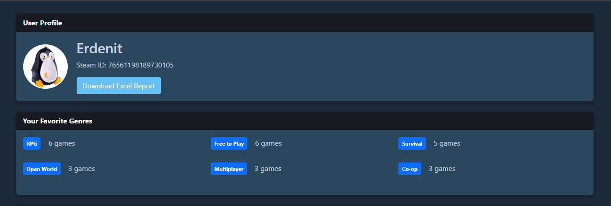
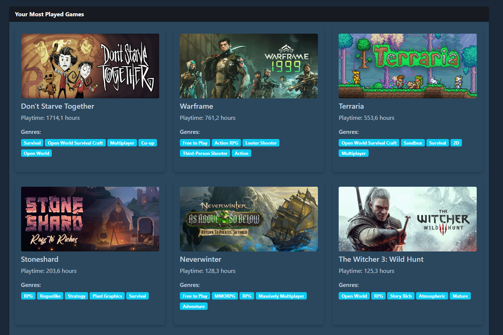
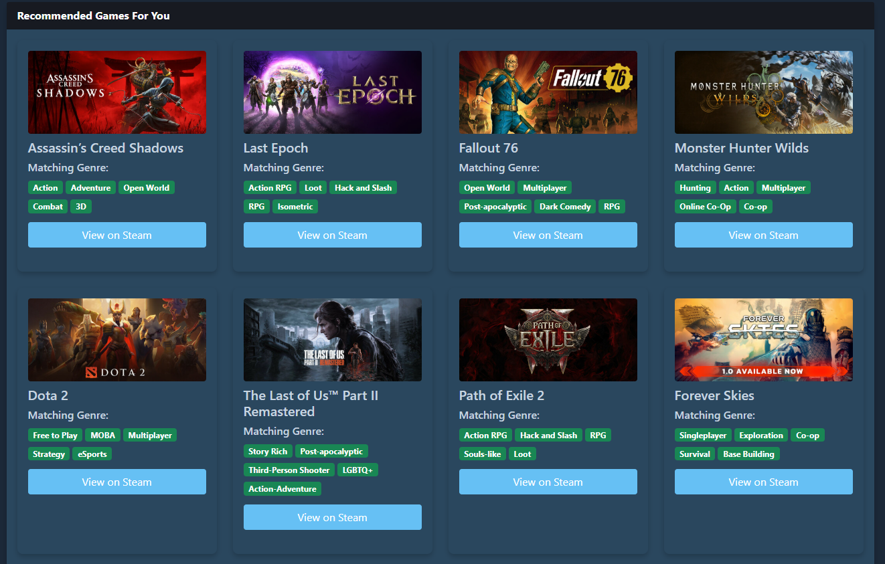
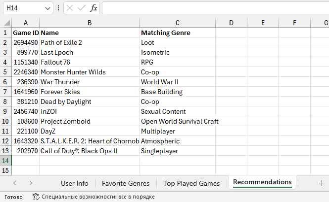

# SteamApp
Spring application,
Danysh Oleh, 122m-24-1
---
### Local adress
* http://localhost:8080 - main page
* http://localhost:8080/recommendations - recommendations page (only POST from main page)
* http://localhost:8080/api/recommendations/{steamId} - get gameRecommendation object from steamid
* http://localhost:8080/download-report/{steamId} - download user report in Excel
---
## Screenshots
### User summaries

### Most played games

### Game Recommendations

### Excel report
